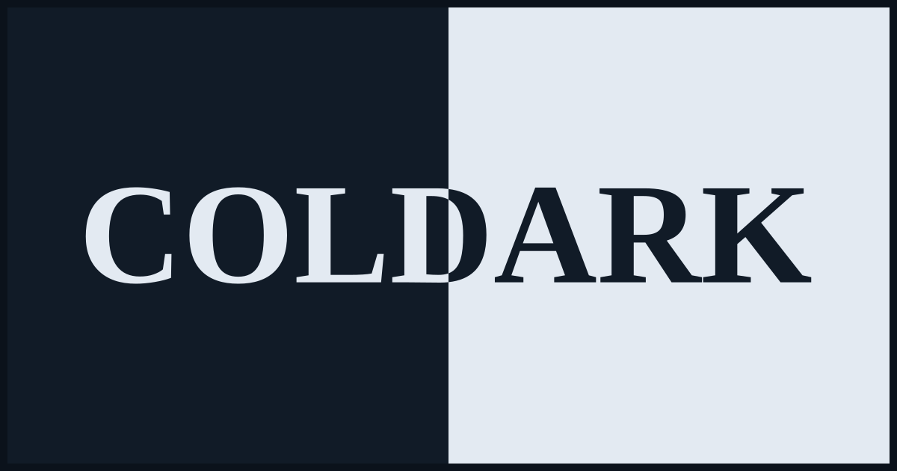
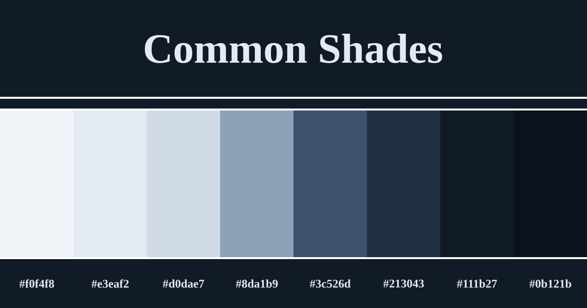
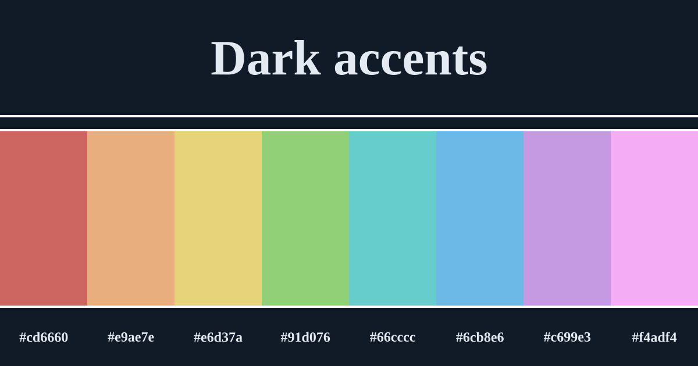
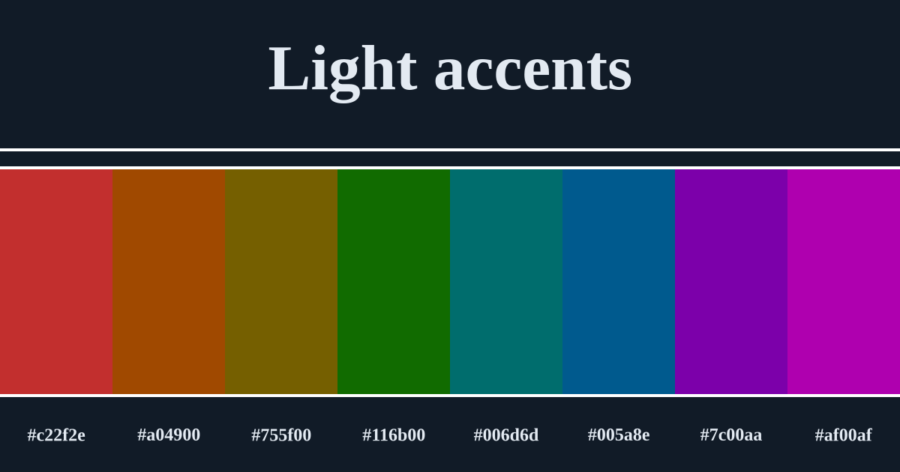

  

A blue-grey theme with light & dark versions.

## Introduction

Coldark is a theme in shades of blue-grey, available in dark and light versions. The colors were carefully chosen to respect the Web Content Accessibility Guidelines (WCAG) and to provide sufficient reading comfort.

However, due to opacity in some variants, it is possible that some contrasts may be reduced and fall below AA level. Don't hesitate to get in touch if you have any issues. The colors aren't set in stone and can still be adjusted if this means better accessibility.

## Color palettes

Coldark consists of three color palettes. The first is common to both versions. The other two each apply to a version.

## Colors in detail

`coldark00` to `coldark07` are the shared neutral ramp, ordered from the lightest shade to the darkest.

`coldark08` to `coldark15` are fixed accent slots by hue. Their role stays the same between variants, while their hex value changes to fit the light or dark context.

### Common shades

| Denomination | Hex Code | Preview | General use |
| :----------: | :------: | :-----: | ----------- |
| `coldark00` | `#f0f4f8` | ![#f0f4f8][#f0f4f8] | Lightest background and elevated surfaces |
| `coldark01` | `#e3eaf2` | ![#e3eaf2][#e3eaf2] | Soft backgrounds and bright UI surfaces |
| `coldark02` | `#d0dae7` | ![#d0dae7][#d0dae7] | Light foregrounds and secondary surfaces |
| `coldark03` | `#8da1b9` | ![#8da1b9][#8da1b9] | Selections, borders, muted emphasis |
| `coldark04` | `#3c526d` | ![#3c526d][#3c526d] | Comments, placeholders, subdued text |
| `coldark05` | `#213043` | ![#213043][#213043] | Strong surfaces and supporting foregrounds |
| `coldark06` | `#111b27` | ![#111b27][#111b27] | Default dark foreground or background, depending on variant |
| `coldark07` | `#0b121b` | ![#0b121b][#0b121b] | Deepest structural background |

### Accent colors

| Denomination | Coldark Cold | Coldark Dark | Preview | General use |
| :----------: | :----------: | :----------: | :-----: | ----------- |
| `coldark08` | `#c22f2e` | `#cd6660` | ![#c22f2e][#c22f2e] / ![#cd6660][#cd6660] | Red for errors, deletions, invalid states, and deprecated items |
| `coldark09` | `#a04900` | `#e9ae7e` | ![#a04900][#a04900] / ![#e9ae7e][#e9ae7e] | Orange for warnings, keywords, and storage-like tokens |
| `coldark10` | `#755f00` | `#e6d37a` | ![#755f00][#755f00] / ![#e6d37a][#e6d37a] | Yellow for modified states, hints, booleans, and attribute names |
| `coldark11` | `#116b00` | `#91d076` | ![#116b00][#116b00] / ![#91d076][#91d076] | Green for additions, strings, and positive states |
| `coldark12` | `#006d6d` | `#66cccc` | ![#006d6d][#006d6d] / ![#66cccc][#66cccc] | Cyan for parameters, tags, CSS variables, and embedded punctuation |
| `coldark13` | `#005a8e` | `#6cb8e6` | ![#005a8e][#005a8e] / ![#6cb8e6][#6cb8e6] | Blue for interactive accents, classes, variables, and headings |
| `coldark14` | `#7c00aa` | `#c699e3` | ![#7c00aa][#7c00aa] / ![#c699e3][#c699e3] | Purple for functions and selector-like identifiers |
| `coldark15` | `#af00af` | `#f4adf4` | ![#af00af][#af00af] / ![#f4adf4][#f4adf4] | Magenta for regex, escapes, values, and high-visibility secondary accents |

## Variations

Coldark is available for:

- [Bat](./packages/coldark-bat/)
- [Dircolors](./packages/coldark-dircolors/)
- [Firefox](./packages/coldark-firefox/)
- [GTKSourceView](./packages/coldark-gtksourceview/)
- [Prism.js](./packages/coldark-prism/)
- [Visual Studio Code](./packages/coldark-vscode/)
- [XFCE4 Terminal](./packages/coldark-xfce4-terminal/)

## Acknowledgements

Coldark is inspired by [base16](https://github.com/chriskempson/base16) and [Nord](https://github.com/arcticicestudio/nord) for color harmonization.

## License

This project is licensed under the [MIT license](./LICENSE).

<!-- REFERENCES -->

<!-- Common shades -->

[#f0f4f8]: ./packages/coldark-assets/colors/common-shades/f0f4f8.svg
[#e3eaf2]: ./packages/coldark-assets/colors/common-shades/e3eaf2.svg
[#d0dae7]: ./packages/coldark-assets/colors/common-shades/d0dae7.svg
[#8da1b9]: ./packages/coldark-assets/colors/common-shades/8da1b9.svg
[#3c526d]: ./packages/coldark-assets/colors/common-shades/3c526d.svg
[#213043]: ./packages/coldark-assets/colors/common-shades/213043.svg
[#111b27]: ./packages/coldark-assets/colors/common-shades/111b27.svg
[#0b121b]: ./packages/coldark-assets/colors/common-shades/0b121b.svg

<!-- Light accent colors -->

[#c22f2e]: ./packages/coldark-assets/colors/light-accents/c22f2e.svg
[#116b00]: ./packages/coldark-assets/colors/light-accents/116b00.svg
[#755f00]: ./packages/coldark-assets/colors/light-accents/755f00.svg
[#005a8e]: ./packages/coldark-assets/colors/light-accents/005a8e.svg
[#af00af]: ./packages/coldark-assets/colors/light-accents/af00af.svg
[#006d6d]: ./packages/coldark-assets/colors/light-accents/006d6d.svg
[#7c00aa]: ./packages/coldark-assets/colors/light-accents/7c00aa.svg
[#a04900]: ./packages/coldark-assets/colors/light-accents/a04900.svg

<!-- Dark accent colors -->

[#cd6660]: ./packages/coldark-assets/colors/dark-accents/cd6660.svg
[#91d076]: ./packages/coldark-assets/colors/dark-accents/91d076.svg
[#e6d37a]: ./packages/coldark-assets/colors/dark-accents/e6d37a.svg
[#6cb8e6]: ./packages/coldark-assets/colors/dark-accents/6cb8e6.svg
[#f4adf4]: ./packages/coldark-assets/colors/dark-accents/f4adf4.svg
[#66cccc]: ./packages/coldark-assets/colors/dark-accents/66cccc.svg
[#c699e3]: ./packages/coldark-assets/colors/dark-accents/c699e3.svg
[#e9ae7e]: ./packages/coldark-assets/colors/dark-accents/e9ae7e.svg
