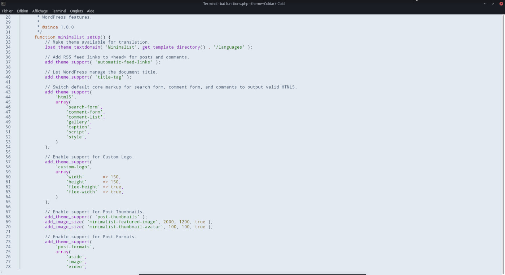
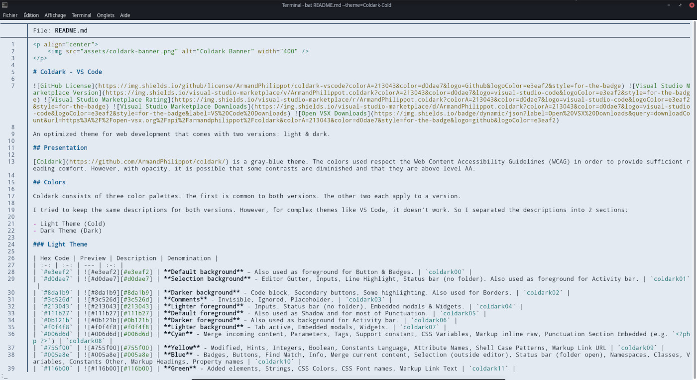
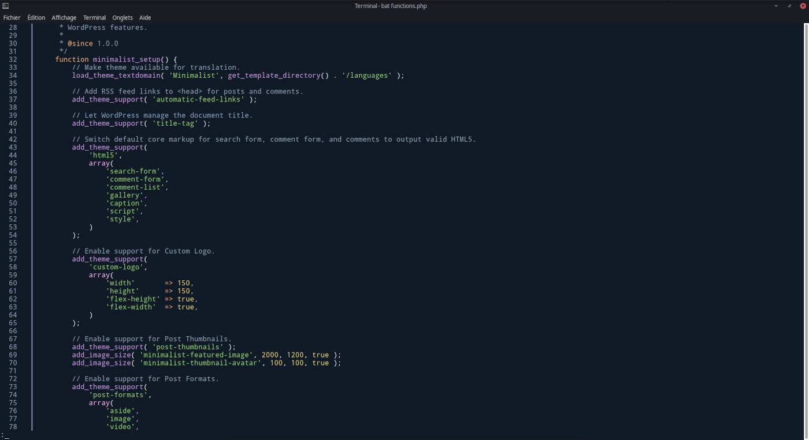
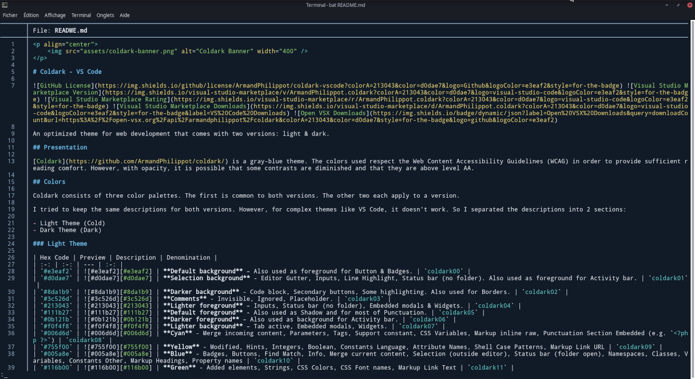

<p align="center">
  
</p>

# Coldark - Bat

 

A theme in shades of blue-grey for bat.

## Introduction

[Coldark](https://github.com/ArmandPhilippot/coldark) is a theme in shades of blue-grey, available in dark and light versions. The colors were carefully chosen to respect the Web Content Accessibility Guidelines (WCAG) and to provide sufficient reading comfort.

This Coldark version is designed for the [bat](https://github.com/sharkdp/bat) command.

## Install

1. Install `bat` (e.g., on Manjaro: `pacman -S bat`)
2. Create a new `themes` folder:
   ```sh
   mkdir -p "$(bat --config-dir)/themes"
   ```
3. Go inside this new folder:
   ```sh
   cd "$(bat --config-dir)/themes"
   ```
4. Clone the package:
   ```sh
   git clone -n --depth=1 --filter=tree:0 https://github.com/ArmandPhilippot/coldark
   cd coldark
   git sparse-checkout set --no-cone /packages/coldark-bat
   git checkout
   ```
5. Update the binary cache:
   ```sh
   bat cache --build
   ```
6. Check if the themes are correctly installed:
   ```sh
   bat --list-themes
   ```

Learn more about [adding themes in bat docs](https://github.com/sharkdp/bat#adding-new-themes).

## Activation

### One time

To select one of the Coldark themes, call `bat` with `--theme=Coldark-Cold` or `--theme=Coldark-Dark`:

```sh
bat --theme=Coldark-Cold
```

### Permanent

You can set the `BAT_THEME` environment variable to `Coldark-Cold` or `Coldark-Dark`. Then, export it in your shell's startup file to make the change permanent.

```bash
# .bashrc
export BAT_THEME="Coldark-Cold"
```

Alternatively, you can use [bat's configuration file](https://github.com/sharkdp/bat#configuration-file).

```
bat --generate-config-file
nano $(bat --config-file)
```

Then, update the theme by uncommenting the line and replacing the value:
```diff
# Specify desired highlighting theme (e.g. "TwoDark"). Run `bat --list-themes`
# for a list of all available themes
-#--theme="TwoDark"
+--theme="Coldark-Dark"
```

## Screenshots

Here are two rendering examples for each version.

### Cold

| PHP                                                                                         | Markdown                                                                                                   |
| ------------------------------------------------------------------------------------------- | ---------------------------------------------------------------------------------------------------------- |
| [](./assets/coldark-cold-bat-php.jpg) | [](./assets/coldark-cold-bat-markdown.jpg) |

### Dark

| PHP                                                                                         | Markdown                                                                                                   |
| ------------------------------------------------------------------------------------------- | ---------------------------------------------------------------------------------------------------------- |
| [](./assets/coldark-dark-bat-php.jpg) | [](./assets/coldark-dark-bat-markdown.jpg) |

## License

This project is licensed under the [MIT license](https://github.com/ArmandPhilippot/coldark/blob/main/LICENSE).
