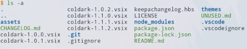
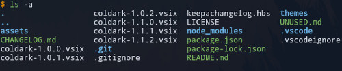
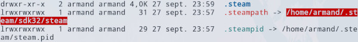
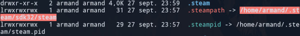
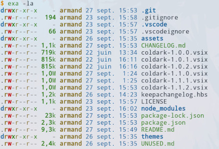
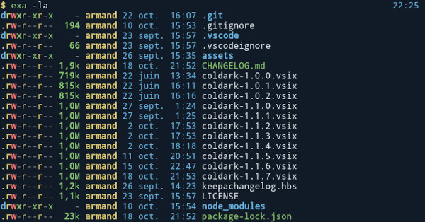
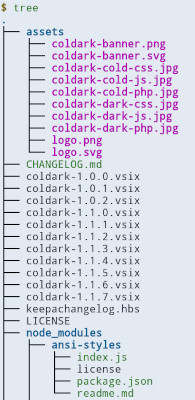
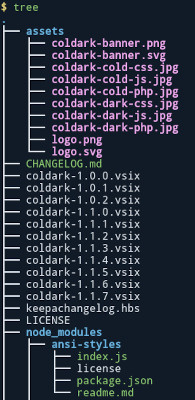

<p align="center">
  
</p>

# Coldark - Dircolors

 

An optimized theme for web development that comes with two versions: light & dark.

## Presentation

[Coldark](https://github.com/ArmandPhilippot/coldark/) is a gray-blue theme. The colors used respect the Web Content Accessibility Guidelines (WCAG) in order to provide sufficient reading comfort.

Coldark dircolors can be installed for all application that respect the `LS_COLORS` environment variable. You can thus use it with commands like `ls`, `tree` ...

It is recommended to use it with [Coldark for XFCE4 terminal](https://github.com/ArmandPhilippot/coldark-xfce4-terminal) so that the colors match those of Coldark.

## Colors

Coldark consists of three color palettes. The first is common to both versions. The other two each apply to a version. Coldark uses 16 colors for each theme.

Coldark dircolors reuses the colors of the terminal: black, white, red, magenta, green, blue, yellow & cyan. If you are using Coldark for XFCE4 terminal, it will only use 8 colors since the normal and bright versions of the colors are the same.

|                | Light Theme |                     | Dark Theme |                     |
| -------------- | ----------- | :-----------------: | :--------: | :-----------------: |
| **Usage code** | **Hex**     |     **Preview**     |  **Hex**   |     **Preview**     |
| `coldark00`    | `#E3E9F2`   | ![#e3eaf2][#e3eaf2] | `#111B27`  | ![#111b27][#111b27] |
| `coldark03`    | `#3c526d`   | ![#3c526d][#3c526d] | `#8da1b9`  | ![#8da1b9][#8da1b9] |
| `coldark05`    | `#111B27`   | ![#111b27][#111b27] | `#E3E9F2`  | ![#e3eaf2][#e3eaf2] |
| `coldark08`    | `#006d6d`   | ![#006d6d][#006d6d] | `#66cccc`  | ![#66cccc][#66cccc] |
| `coldark09`    | `#755f00`   | ![#755f00][#755f00] | `#e6d37a`  | ![#e6d37a][#e6d37a] |
| `coldark10`    | `#005a8e`   | ![#005a8e][#005a8e] | `#6cb8e6`  | ![#6cb8e6][#6cb8e6] |
| `coldark11`    | `#116b00`   | ![#116b00][#116b00] | `#91d076`  | ![#91d076][#91d076] |
| `coldark12`    | `#af00af`   | ![#af00af][#af00af] | `#f4adf4`  | ![#f4adf4][#f4adf4] |
| `coldark15`    | `#c22f2e`   | ![#c22f2e][#c22f2e] | `#cd6660`  | ![#cd6660][#cd6660] |

- **`coldark00`: Black**  
  Used as foreground for sticky other writable directories.
- **`coldark00`: Dark gray**  
  Used as foreground for ignored files (like `.log`, `.bak` ...).
- **`coldark05`: White**  
  Used as foreground for missing files, files with setuid or setgid permissions, files with capability, sticky not other writable directories.
- **`coldark08`: Cyan**  
  Used as foreground for symbolic links, regular files with more than one link, pipes and audio files.
- **`coldark09`: Yellow**  
  Used as foreground for socket files, block devices drivers and character device drivers and video files.
- **`coldark10`: Blue**  
  Used as foreground for directories and as background for sticky not other writable directories.
- **`coldark11`: Green**  
  Used as foreground for other writable directories, archives and various documents. Also used as background for sticky other writable directories.
- **`coldark12`: Magenta**  
  Used as foreground for doors and images..
- **`coldark15`: Red**  
  Used as foreground for orphaned symbolic links and executable. Also used as background for missing files.

## Screenshots

Some examples with `ls`, symbolic links (and missing file), `exa` and `tree`.

|                       Light Theme                        |                       Dark Theme                        |
| :------------------------------------------------------: | :-----------------------------------------------------: |
|              |              |
|  |  |
|            |            |
|          |          |

## Install

Download the [](https://github.com/ArmandPhilippot/coldark-dircolors/blob/master/dir_colors) file, rename it as `.dir_colors` and place it in your home directory (so `~/.dir_colors`).

## Activation

To activate and use Coldark dircolors as your default color theme for all sessions, you need to edit the configuration file of your shell (`~/.bashrc`, `~/.zshrc`, ... ). Once opened, add the following snippet:

```
# Load Coldark dircolors.
eval "$(dircolors ~/.dir_colors)"
```

## For OhMyZsh users

If you are using OhMyZsh on GNU/Linux, you should place the following code in `~/.zshrc`, right after the `eval`, so that the tab completion uses the same colors:

```
# Zsh Completion with LS Colors
zstyle ':completion:*:default' list-colors "$LS_COLORS"
```

Thanks to [rarylson](https://github.com/ohmyzsh/ohmyzsh/issues/6060#issuecomment-572863893) for the trick.

## License

This project is open source and available under the [MIT License](https://github.com/ArmandPhilippot/coldark/blob/main/LICENSE).

<!-- REFERENCES -->

<!-- UI Colors -->

[#f0f4f8]: https://github.com/ArmandPhilippot/coldark/blob/main/packages/coldark-assets/colors/common-shades/f0f4f8.svg
[#e3eaf2]: https://github.com/ArmandPhilippot/coldark/blob/main/packages/coldark-assets/colors/common-shades/e3eaf2.svg
[#d0dae7]: https://github.com/ArmandPhilippot/coldark/blob/main/packages/coldark-assets/colors/common-shades/d0dae7.svg
[#8da1b9]: https://github.com/ArmandPhilippot/coldark/blob/main/packages/coldark-assets/colors/common-shades/8da1b9.svg
[#3c526d]: https://github.com/ArmandPhilippot/coldark/blob/main/packages/coldark-assets/colors/common-shades/3c526d.svg
[#213043]: https://github.com/ArmandPhilippot/coldark/blob/main/packages/coldark-assets/colors/common-shades/213043.svg
[#111b27]: https://github.com/ArmandPhilippot/coldark/blob/main/packages/coldark-assets/colors/common-shades/111b27.svg
[#0b121b]: https://github.com/ArmandPhilippot/coldark/blob/main/packages/coldark-assets/colors/common-shades/0b121b.svg

<!-- Syntax - Light Theme Colors -->

[#c22f2e]: https://github.com/ArmandPhilippot/coldark/blob/main/packages/coldark-assets/colors/light-accents/c22f2e.svg
[#116b00]: https://github.com/ArmandPhilippot/coldark/blob/main/packages/coldark-assets/colors/light-accents/116b00.svg
[#755f00]: https://github.com/ArmandPhilippot/coldark/blob/main/packages/coldark-assets/colors/light-accents/755f00.svg
[#005a8e]: https://github.com/ArmandPhilippot/coldark/blob/main/packages/coldark-assets/colors/light-accents/005a8e.svg
[#af00af]: https://github.com/ArmandPhilippot/coldark/blob/main/packages/coldark-assets/colors/light-accents/af00af.svg
[#006d6d]: https://github.com/ArmandPhilippot/coldark/blob/main/packages/coldark-assets/colors/light-accents/006d6d.svg
[#7c00aa]: https://github.com/ArmandPhilippot/coldark/blob/main/packages/coldark-assets/colors/light-accents/7c00aa.svg
[#a04900]: https://github.com/ArmandPhilippot/coldark/blob/main/packages/coldark-assets/colors/light-accents/a04900.svg

<!-- Syntax - Dark Theme Colors -->

[#cd6660]: https://github.com/ArmandPhilippot/coldark/blob/main/packages/coldark-assets/colors/dark-accents/cd6660.svg
[#91d076]: https://github.com/ArmandPhilippot/coldark/blob/main/packages/coldark-assets/colors/dark-accents/91d076.svg
[#e6d37a]: https://github.com/ArmandPhilippot/coldark/blob/main/packages/coldark-assets/colors/dark-accents/e6d37a.svg
[#6cb8e6]: https://github.com/ArmandPhilippot/coldark/blob/main/packages/coldark-assets/colors/dark-accents/6cb8e6.svg
[#f4adf4]: https://github.com/ArmandPhilippot/coldark/blob/main/packages/coldark-assets/colors/dark-accents/f4adf4.svg
[#66cccc]: https://github.com/ArmandPhilippot/coldark/blob/main/packages/coldark-assets/colors/dark-accents/66cccc.svg
[#c699e3]: https://github.com/ArmandPhilippot/coldark/blob/main/packages/coldark-assets/colors/dark-accents/c699e3.svg
[#e9ae7e]: https://github.com/ArmandPhilippot/coldark/blob/main/packages/coldark-assets/colors/dark-accents/e9ae7e.svg
