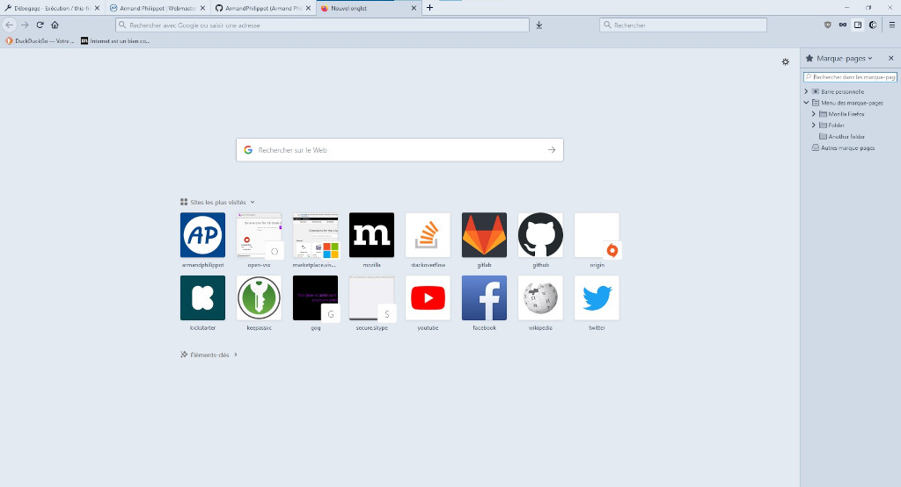
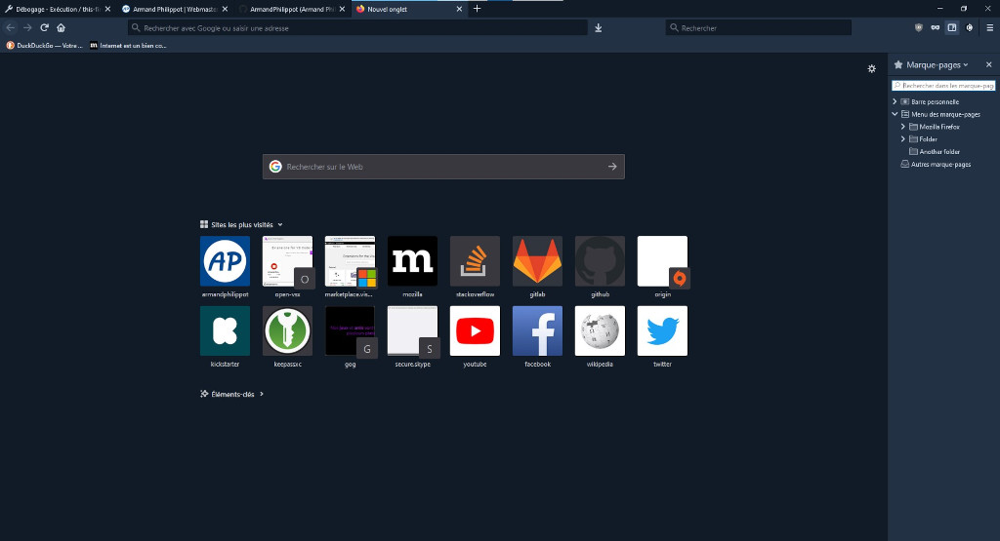

  

# Coldark - Firefox

 

A theme in shades of blue-grey adapted for Firefox.

## Introduction

[Coldark](https://github.com/ArmandPhilippot/coldark/) is a theme in shades of blue-grey, available in dark and light versions. Its colors have been carefully chosen to offer sufficient reading comfort in most situations.

This variant is designed for [Firefox](https://www.mozilla.org/fr/firefox/). Although, Coldark uses 16 colors, the Firefox version only uses 7. Some elements do not seem customizable like the tab hover or the search box on the new tab page.

## Features

- Detects if the user prefers the dark theme and automatically applies the dark version.
- Allows you to switch between versions using an icon in the navigation bar.
- Allows you to switch between versions using a shortcut (defaults to <kbd>Alt+T</kbd>).

If the shortcut doesn't work, check that it's not being used by another extension. If necessary, replace the shortcut either for Coldark or for the other extension.

## Colors

Firefox uses a small subset of the shared Coldark palette. The neutral denominations stay fixed across variants, while the blue accent keeps the same denomination and changes value with the variant.

| Denomination | Coldark Cold | Coldark Dark | Preview | Usage in Firefox |
| :----------: | :----------: | :----------: | :-----: | ---------------- |
| `coldark00` | `#f0f4f8` | `#f0f4f8` | ![#f0f4f8][#f0f4f8] | Popup, focused fields, and elevated button states in Coldark Cold |
| `coldark01` | `#e3eaf2` | `#e3eaf2` | ![#e3eaf2][#e3eaf2] | Default foreground for selected tab and toolbar in Coldark Dark |
| `coldark02` | `#d0dae7` | `#d0dae7` | ![#d0dae7][#d0dae7] | Icons, popup text, field text, and inactive tab foreground in Coldark Dark |
| `coldark03` | `#8da1b9` | `#8da1b9` | ![#8da1b9][#8da1b9] | Unused by the current Firefox theme |
| `coldark04` | `#3c526d` | `#3c526d` | ![#3c526d][#3c526d] | Popup and focused field background in Coldark Dark |
| `coldark05` | `#213043` | `#213043` | ![#213043][#213043] | Selected tab, toolbar, and sidebar background in Coldark Dark |
| `coldark06` | `#111b27` | `#111b27` | ![#111b27][#111b27] | Default foreground in Coldark Cold and default background in Coldark Dark |
| `coldark07` | `#0b121b` | `#0b121b` | ![#0b121b][#0b121b] | Inactive frame, highlight, and border background in Coldark Dark |
| `coldark13` | `#005a8e` | `#6cb8e6` | ![#005a8e][#005a8e] / ![#6cb8e6][#6cb8e6] | Special icons, focus border, selected tab border, tab loading, and field highlight |

For Coldark Cold specifically, the browser chrome also uses `coldark01` (`#e3eaf2`) as the main frame and field background, `coldark02` (`#d0dae7`) for selected tab and toolbar surfaces, `coldark03` (`#8da1b9`) for inactive frame and border emphasis, `coldark05` (`#213043`) for icon and popup foreground, and `coldark06` (`#111b27`) for the main foreground text.

## Screenshots

| Light theme | Dark theme |
| :---------: | :--------: |
|  |  |

## How to install

1. Download the latest version of Coldark for Firefox from the `web-ext-artifacts` directory.
2. Open the Addons menu (e.g. `about:addons`)
3. Click on the gear icon next to <kbd><samp>Manage Your Extensions
</samp></kbd>, then select <kbd><samp>Install Add-on From File...
</samp></kbd>.
4. Find and select the `.xpi` file downloaded at step 1 (e.g. `coldark-1.0.3-an+fx.xpi`).

## License

This project is open source and available under the [MIT License](https://github.com/ArmandPhilippot/coldark/blob/main/LICENSE).

<!-- REFERENCES -->

<!-- UI Colors -->

[#f0f4f8]: https://raw.githubusercontent.com/ArmandPhilippot/coldark/refs/heads/main/packages/coldark-assets/colors/common-shades/f0f4f8.svg
[#e3eaf2]: https://raw.githubusercontent.com/ArmandPhilippot/coldark/refs/heads/main/packages/coldark-assets/colors/common-shades/e3eaf2.svg
[#d0dae7]: https://raw.githubusercontent.com/ArmandPhilippot/coldark/refs/heads/main/packages/coldark-assets/colors/common-shades/d0dae7.svg
[#8da1b9]: https://raw.githubusercontent.com/ArmandPhilippot/coldark/refs/heads/main/packages/coldark-assets/colors/common-shades/8da1b9.svg
[#3c526d]: https://raw.githubusercontent.com/ArmandPhilippot/coldark/refs/heads/main/packages/coldark-assets/colors/common-shades/3c526d.svg
[#213043]: https://raw.githubusercontent.com/ArmandPhilippot/coldark/refs/heads/main/packages/coldark-assets/colors/common-shades/213043.svg
[#111b27]: https://raw.githubusercontent.com/ArmandPhilippot/coldark/refs/heads/main/packages/coldark-assets/colors/common-shades/111b27.svg
[#0b121b]: https://raw.githubusercontent.com/ArmandPhilippot/coldark/refs/heads/main/packages/coldark-assets/colors/common-shades/0b121b.svg

<!-- Syntax - Light Theme Colors -->

[#005a8e]: https://raw.githubusercontent.com/ArmandPhilippot/coldark/refs/heads/main/packages/coldark-assets/colors/light-accents/005a8e.svg

<!-- Syntax - Dark Theme Colors -->

[#6cb8e6]: https://raw.githubusercontent.com/ArmandPhilippot/coldark/refs/heads/main/packages/coldark-assets/colors/dark-accents/6cb8e6.svg
