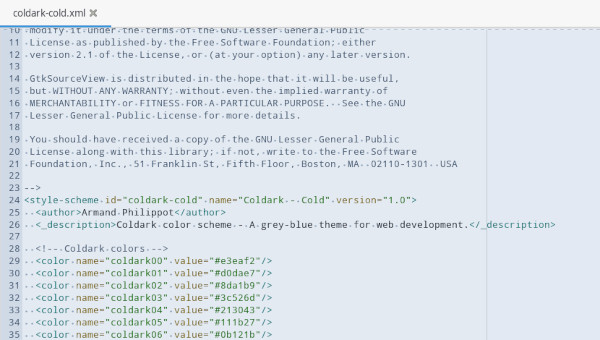
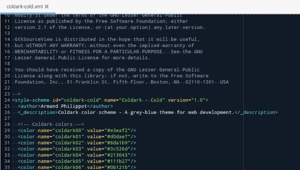
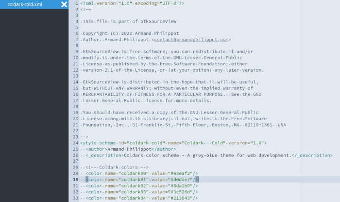
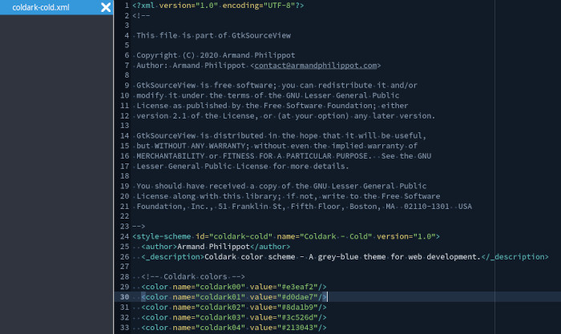

<p align="center">
  
</p>

# Coldark - GTK Source View

 

A theme in shades of blue-grey adapted for GTK.

## Introduction

[Coldark](https://github.com/ArmandPhilippot/coldark/) is a theme in shades of blue-grey, available in dark and light versions. Its colors have been carefully chosen to offer sufficient reading comfort in most situations.

This variant is designed for [GtkSourceView](https://wiki.gnome.org/Projects/GtkSourceView)-based text editors such as [Mousepad](https://github.com/codebrainz/mousepad) and [Gedit](https://wiki.gnome.org/Apps/Gedit).

This variant is designed to offer a similar appearance to the [VSCode version](https://github.com/ArmandPhilippot/coldark/tree/main/packages/coldark-vscode). However, you might notice some differences, as the provided tokens are slightly different and less comprehensive.

## Screenshots

The following screenshots show an XML file opened in Mousepad and Gedit:

| Light Theme | Dark Theme |
| :---------: | :--------: |
|  |  |
|  |  |

## Install & Activation

First, download `coldark-cold.xml` and/or `coldark-dark.xml` from this repository. Then, follow the instructions below for your text editor.

### Mousepad

1. If it doesn't exist, create the following directory:
    ```sh
    mkdir -p ~/.local/share/gtksourceview-4/styles/
    ```
2. Place the color schemes in `~/.local/share/gtksourceview-4/styles/`.
3. Reopen Mousepad for the new themes to be available.
4. Open the <kbd><samp>View</samp></kbd> menu, then, in the <kbd><samp>Color scheme</samp></kbd> menu option, select either <kbd><samp>Coldark - Cold</samp></kbd> or <kbd><samp>Coldark - Dark</samp></kbd>. Alternatively, you can open the <kbd><samp>Preferences</samp></kbd> menu option in <kbd><samp>Edit</samp></kbd>, then, in the <kbd><samp>View</samp></kbd> tab, you can select the theme under <kbd><samp>Color scheme</samp></kbd>.

### Gedit

1. If it doesn't exist, create the following directory:
    ```sh
    mkdir -p ~/.local/share/gedit/styles/
    ```
2. Place the color schemes in `~/.local/share/gedit/styles/`.
3. Reopen Gedit for the new themes to be available.
4. Open the <kbd><samp>Preferences</samp></kbd> menu option, then, in the <kbd><samp>Fonts & Colors</samp></kbd> tab, select either <kbd><samp>Coldark - Cold</samp></kbd> or <kbd><samp>Coldark - Dark</samp></kbd> under the <kbd><samp>Color Scheme</samp></kbd> list.

### Other softwares

It is perfectly possible to proceed in the same way for other software using GTKSourceView. Unless I'm mistaken, the themes are compatible with versions 2, 3, and 4 of GTKSourceView.

However, I have only tested with Mousepad and Gedit, so it is possible that some elements may not be correctly integrated in other text editors.

## License

This project is open source and available under the [MIT License](https://github.com/ArmandPhilippot/coldark/blob/main/LICENSE).
