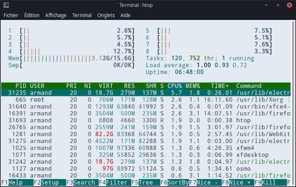
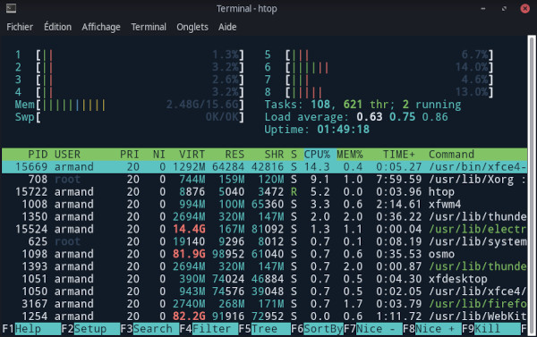
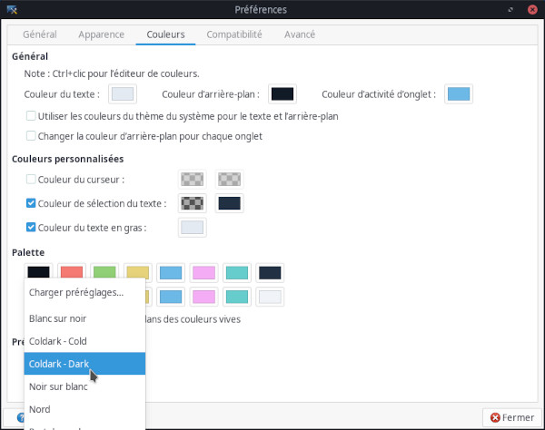

<p align="center">
  
</p>

# Coldark - XFCE Terminal

 

A theme in shades of blue-grey adapted for the XFCE terminal.

## Introduction

[Coldark](https://github.com/ArmandPhilippot/coldark/) is a theme in shades of blue-grey, available in dark and light versions. Its colors have been carefully chosen to offer sufficient reading comfort in most situations.

This variant is designed for the [XFCE terminal](https://gitlab.xfce.org/apps/xfce4-terminal). Although, Coldark uses 16 colors, the XFCE terminal version only uses 11.

## Screenshots

| Light Theme | Dark Theme |
| :---------: | :--------: |
|  |  |

## How to install

1. If it doesn't exist yet, create the following directory:
    ```sh
    mkdir -p ~/.local/share/xfce4/terminal/colorschemes/
    ```
2. Download `coldark-cold.theme` and/or `coldark-dark.theme`
3. Place the downloaded color schemes in `~/.local/share/xfce4/terminal/colorschemes/`.

## Activation

1. Open your XFCE4 terminal
2. Open the <kbd><samp>Edit</samp></kbd> menu and select the <kbd><samp>Preferences</samp></kbd> menu option.
3. In this new window, select the <kbd><samp>Colors</samp></kbd> tab.
4. Click on the <kbd><samp>Load Presets</samp></kbd> drop-down menu and, in the list, select either <kbd><samp>Coldark - Cold</samp></kbd> or <kbd><samp>Coldark - Dark</samp></kbd>.



## License

This project is open source and available under the [MIT License](https://github.com/ArmandPhilippot/coldark/blob/main/LICENSE).
